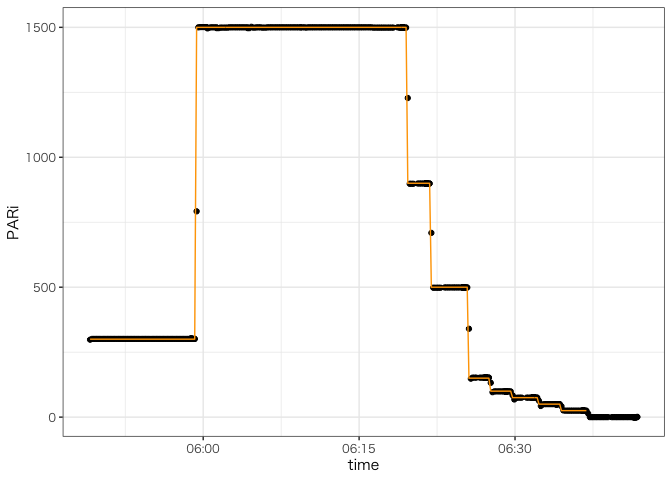

<!-- README.md is generated from README.Rmd. Please edit that file -->

## Installation

**The present version does not support Windows.** You can install the
development version from [GitHub](https://github.com/) with:

``` r
# install.packages("devtools")
devtools::install_github("KeachMurakami/li6400xt")
```

## core function

Load data using `read_licor`. Note that file must be tab-separated
*text*, not *xls* automatically generated by the LI6400XT system.

``` r
library(li6400xt)

library(tidyverse)
library(patchwork)
#> 
#> Attaching package: 'patchwork'
#> The following object is masked from 'package:raster':
#> 
#>     area
#> The following object is masked from 'package:MASS':
#> 
#>     area

file <- system.file("light_curve.txt", package = "li6400xt")

mydata <- read_licor(file)
print(mydata)
#> # A tibble: 525 x 59
#>    file  time                Obs   FTime  EBal Photo   Cond     Ci  FCnt  DCnt
#>  * <chr> <dttm>              <chr> <dbl> <dbl> <dbl>  <dbl>  <dbl> <dbl> <dbl>
#>  1 ligh… 2021-06-21 05:49:07 1      29.5     0 -6.77 0.0791  489       0     0
#>  2 ligh… 2021-06-21 05:49:18 2      40       0 -1.02 0.0806  369       0     0
#>  3 ligh… 2021-06-21 05:49:28 3      50.5     0 16.2  0.0828   34.6     0     0
#>  4 ligh… 2021-06-21 05:49:39 4      61       0 32.8  0.0845 -261       0     0
#>  5 ligh… 2021-06-21 05:49:49 5      71.5     0 16.6  0.0871   66.7     0     0
#>  6 ligh… 2021-06-21 05:50:00 6      82       0  9.84 0.0896  201       0     0
#>  7 ligh… 2021-06-21 05:50:10 7      92.5     0 15.5  0.0936  114       0     0
#>  8 ligh… 2021-06-21 05:50:21 8     103       0 16.6  0.096   109       0     0
#>  9 ligh… 2021-06-21 05:50:31 9     114.      0 10.5  0.098   220       0     0
#> 10 ligh… 2021-06-21 05:50:42 10    124       0  8.18 0.101   265       0     0
#> # … with 515 more rows, and 49 more variables: Fs <dbl>, Adark <dbl>,
#> #   RedAbs <dbl>, BlueAbs <dbl>, `%Blue` <dbl>, LeafAbs <dbl>, PhiCO2 <dbl>,
#> #   `ParIn@Fs` <dbl>, `PS2/1` <dbl>, Trmmol <dbl>, VpdL <dbl>, CTleaf <dbl>,
#> #   Area <dbl>, BLC_1 <dbl>, StmRat <dbl>, BLCond <dbl>, Tair <dbl>,
#> #   Tleaf <dbl>, TBlk <dbl>, CO2R <dbl>, CO2S <dbl>, H2OR <dbl>, H2OS <dbl>,
#> #   RH_R <dbl>, RH_S <dbl>, Flow <dbl>, PARi <dbl>, PARo <dbl>, Press <dbl>,
#> #   CsMch <dbl>, HsMch <dbl>, StableF <dbl>, BLCslope <dbl>, BLCoffst <dbl>,
#> #   f_parin <dbl>, f_parout <dbl>, alphaK <dbl>, Status <dbl>, Fo <dbl>,
#> #   Fm <dbl>, `Fo'` <dbl>, `Fm'` <dbl>, `Fv/Fm` <dbl>, `Fv'/Fm'` <dbl>,
#> #   PhiPS2 <dbl>, qP <dbl>, qN <dbl>, NPQ <dbl>, ETR <dbl>

net_photosynthesis <-
  mydata %>%
  ggplot(aes(time, Photo, col = PARi)) +
  geom_line() +
  scale_color_viridis_c()
stomatal_conductance <- 
  mydata %>%
  ggplot(aes(time, Cond, col = PARi)) +
  geom_line() +
  scale_color_viridis_c()

net_photosynthesis / stomatal_conductance
```


``` r
mydata %>%
  ggplot(aes(PARi, Photo, col = PARi)) +
  geom_point() +
  geom_smooth() +
  scale_color_viridis_c()
#> `geom_smooth()` using method = 'loess' and formula 'y ~ x'
```


## miscellaneous functions

File remark and operational change logs are available as `attributes`.

``` r
# check remark noted on file creation
attributes(mydata)$remark
#> [1] "15mm"

# check operational change logs
attributes(mydata)$control
#> # A tibble: 77 x 3
#>    time                log                                           file       
#>    <dttm>              <chr>                                         <chr>      
#>  1 2021-06-21 05:48:55 Launched AutoProg /User/Configs/AutoProgs/Au… light_curv…
#>  2 2021-06-21 05:48:57 Log AvgTime changed to 15 s                   light_curv…
#>  3 2021-06-21 05:48:57 LCF Lamp: ParIn -> 300 uml, with blue = 10 p… light_curv…
#>  4 2021-06-21 05:48:57 CO2 Mixer: CO2S -> 400 uml                    light_curv…
#>  5 2021-06-21 05:48:57 Coolers: Tleaf -> 22.00 C                     light_curv…
#>  6 2021-06-21 05:48:57 Flow: Fixed -> 300 umol/s                     light_curv…
#>  7 2021-06-21 05:59:01 Fs=234 Msr=1 Mod=0.25 Filter=5 Gain=10        light_curv…
#>  8 2021-06-21 05:59:01 RF#1 8672 um, Fmax=489 Int=9 Mod=20 Filter=50 light_curv…
#>  9 2021-06-21 05:59:03 Fm'=489                                       light_curv…
#> 10 2021-06-21 05:59:11 Fo'=119                                       light_curv…
#> # … with 67 more rows
```

Chamber environments usually fluctuate, making the analysis bothersome.
Use `track_changes` to add a column showing set-point values.

``` r
mydata %>%
  track_changes(track = "LCF", variable = "PPFD") %>%
  ggplot(aes(time, PARi)) +
  geom_point() +
  geom_line(aes(y = PPFD), col = "orange")
#> Warning: Removed 54 row(s) containing missing values (geom_path).
```



-   `track = LCF`: tracks changes in PARi
-   <WIP> `track = XXX`: tracks change in CO2
-   <WIP> `track = XXX`: tracks change in Tair/Tleaf

Leaves are not always broad enough to cover the chamber (e.g. wheat and
rice). Use `correct_leaf_area` to calculate leaf area sandwitched by the
chamber. This function calculates corrected `Area`, `Photo`, `Cond`, and
`Trmmol` from given leaf width (`width_mm`) and chamber model (`model`).

``` r
# Original area
mydata$Area[1]
#> [1] 2

# Corrected area
corrected_mydata <- correct_leaf_area(mydata, width_mm = 15, model = "6400-40")
corrected_mydata$Area[1]
#> [1] 1.692772
```

## standard workflow

``` r
data_of_multiple_leaves <-
  dir("PATH_TO_LI6400XT_DIR") %>%
  purrr::map(function(file){
    
    # read file
    data <- read_licor(file)
    
    # get leaf width from file remark
    width <- readr::parse_number(attributes(data)$remark)
    
    # correct area and track PPFD change
    data %>%
      correct_leaf_area(width_mm = width, model = "6400-40") %>%
      track_changes(track = "LCF", variable = "PPFD") %>%
      return()
  })
```
